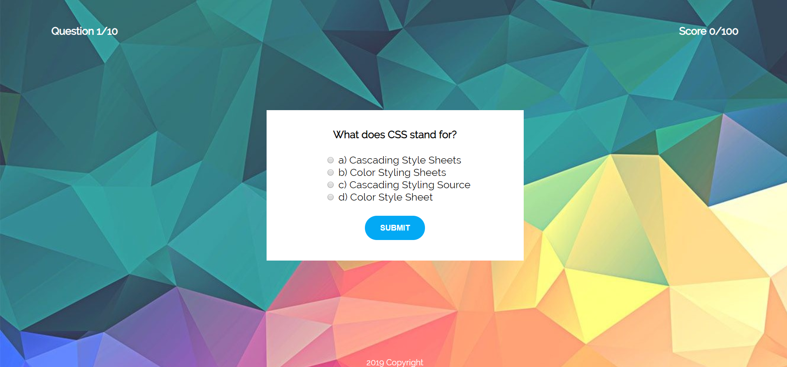

# CSS-Quiz

## Description
CSS Quiz is a JavaScript application used to test CSS skills.

## Visuals

!!!

## Usage
User must select 1 option out of 4 to get to the next question. Each correctly answered question is worth 10 points. The quiz consists of 10 questions and user can earn 100 points in total.

## Support
alexandrakollarova91@gmail.com

